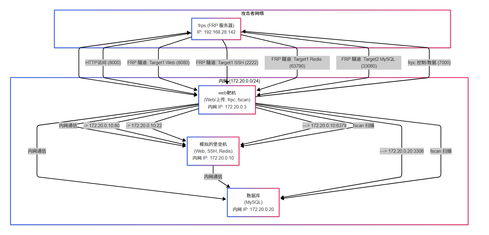
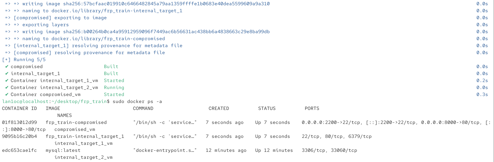

# frp_train
嗯为了初学者练习frp使用的一个简易靶场，拓扑如下：

## 详情
设定以下固定 IP 地址：
- 内网子网：`172.20.0.0/24`
- 出网的机器(`frps_server`) 在内网中的 IP：`172.20.0.3`
- 堡垒机内网中的 IP：`172.20.0.10`
- 数据库在内网中的IP：`172.20.0.20`
整个操作思路：
靶场总共有三台机子，一台能出网，两台台不出网，出网的那台模拟的是被web渗透成功上传了frpc，然后攻击机上运行frps，两边一运行，代理上了内网流量，攻击机以出网的机子为跳板能访问到不出网的内网机器(模拟任意文件文件上传漏洞，但是有上传大小限制)
# 使用
```
sudo docker compose up -d --build
```

详情见[此](https://lan1oc.co/2025/04/18/frp/)
